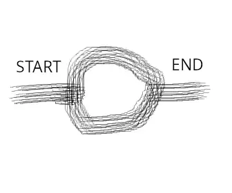

# search_seq_including_spaces
## Summary

Narrowly, Find sequences including nucleotide(or amino acid) spaces and Output the results to every csv file.

You can confirm for Bioinformatics Tips at Wiki.

(Broadly, you can find the speific sequences of front and back while ignoring the middle sequences)

(Language: Python3.9)

## SEARCH_SEQUENCE_IMAGE: 

## References
・About Nucleotides:https://www.ncbi.nlm.nih.gov/nuccore/

・About amino-acid: https://www.ncbi.nlm.nih.gov/protein/
