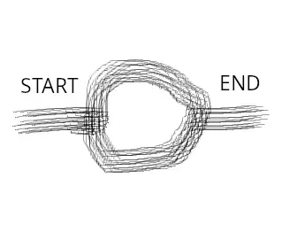

# search_seq_including_spaces
## Summary


- Narrowly, Find sequences including nucleotide(or amino acid) spaces and Output the results to every csv file.
- Broadly, you can find the speific sequences of front and back while ignoring the middle sequences)
- Language: Python (3.11+)
>__Note__ You can confirm for Bioinformatics Tips at Wiki.


[](https://github.com/myon-bioinformatics/search_seq_including_spaces/actions/workflows/codeql.yml)

[](https://github.com/myon-bioinformatics)
[](https://www.reddit.com/user/myon_reddit/)
[](https://twitter.com/myonitbusiness)


## Protein sequence tools (in development)
Standard library only (Python 3.11+). Values are sequence-derived hints, not structure.

```sh
python sequence_tool.py fasta validate in.fasta
python sequence_tool.py protein features in.fasta            # JSON (protein-hints/1)
python sequence_tool.py protein profile in.fasta --window 9  # per-residue TSV (or --json / --jsonl)
```

Ambiguity codes B/Z/J/X are excluded by default (`--ambiguity mean-of-candidates` to opt in). Exit code 2 means an input error.

## SEARCH_SEQUENCE_IMAGE


## References
- About Nucleotides:https://www.ncbi.nlm.nih.gov/nuccore/
- About amino-acid: https://www.ncbi.nlm.nih.gov/protein/
